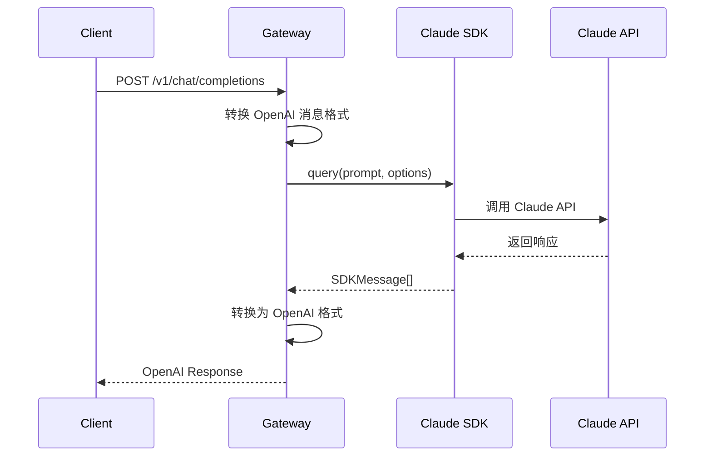
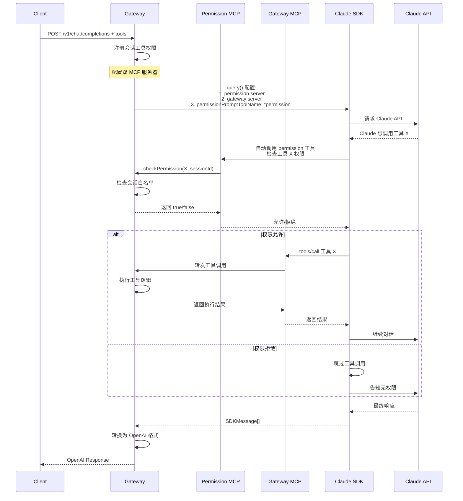

# 架构设计文档

## 系统架构

### 整体架构图

```
┌─────────────────────────────────────────────────────────────────────────┐
│                           客户端层                                        │
├─────────────────────────────────────────────────────────────────────────┤
│  OpenAI SDK (Python)  │  OpenAI SDK (JS)  │  curl/HTTP  │  其他客户端   │
└───────────────┬─────────────────┬──────────────┬──────────────┬────────┘
                │                 │              │              │
                ▼                 ▼              ▼              ▼
┌─────────────────────────────────────────────────────────────────────────┐
│                          API Gateway 层                                   │
├─────────────────────────────────────────────────────────────────────────┤
│  ┌─────────────┐  ┌──────────────┐  ┌───────────┐  ┌───────────────┐  │
│  │   OpenAI    │  │   Message     │  │    MCP    │  │  Permission   │  │
│  │ Endpoints   │  │  Converter    │  │  Gateway  │  │  Controller   │  │
│  └─────────────┘  └──────────────┘  └───────────┘  └───────────────┘  │
└─────────────────────────────────────────────────────────────────────────┘
                                    │
                                    ▼
┌─────────────────────────────────────────────────────────────────────────┐
│                         Claude Code SDK 层                                │
├─────────────────────────────────────────────────────────────────────────┤
│              query() 函数  │  权限控制  │  MCP 协议                      │
└─────────────────────────────────────────────────────────────────────────┘
                                    │
                                    ▼
┌─────────────────────────────────────────────────────────────────────────┐
│                           Claude API                                     │
└─────────────────────────────────────────────────────────────────────────┘
```

## 核心组件

### 1. API Gateway 层

#### OpenAI Endpoints
- `/v1/chat/completions` - 聊天完成接口
- `/v1/models` - 模型列表接口
- `/health` - 健康检查接口

#### MCP Endpoints
- `/mcp/permission` - 权限服务器（预留，当前未使用）
- `/mcp/gateway` - 工具网关服务器
- `/mcp/permission/check` - 权限检查接口

#### Message Converter
负责 OpenAI 格式和 Claude 格式之间的转换：

```typescript
interface MessageConverter {
  // OpenAI → Claude
  buildClaudePrompt(messages: OpenAIMessage[], sessionId: string): string;
  
  // Claude → OpenAI
  convertToOpenAIResponse(claudeMessages: SDKMessage[]): OpenAIResponse;
  
  // 工具调用转换
  convertToolCalls(tools: OpenAITool[]): MCPTool[];
}
```

### 2. MCP Gateway

统一的 MCP 端口设计，支持多客户端连接：

```typescript
interface MCPGateway {
  // 注册客户端工具
  registerTools(sessionId: string, tools: OpenAITool[]): void;
  
  // 处理工具调用
  handleToolCall(request: MCPRequest): Promise<MCPResponse>;
  
  // 路由到正确的处理器
  route(sessionId: string, toolName: string): ToolHandler;
}
```

### 3. Permission Controller

基于双 MCP 服务器的权限控制架构：

```typescript
interface PermissionController {
  // 检查工具权限
  checkPermission(toolName: string, sessionId: string): boolean;
  
  // 注册会话权限
  registerSession(sessionId: string, allowedTools: string[]): void;
  
  // 审计日志
  audit(event: PermissionEvent): void;
}
```

#### 双 MCP 服务器架构

1. **Permission MCP Server** - 权限控制服务器
   - 提供 `permission` 工具
   - 由 `permissionPromptToolName` 参数指定
   - 基于会话白名单控制工具访问
   - 白名单 = 客户端请求时提供的工具列表

2. **Gateway MCP Server** - 工具执行服务器
   - 动态提供会话允许的工具
   - 执行实际的工具调用
   - 返回工具执行结果
   - 工具列表根据会话动态生成

## 消息流转

### 1. 普通对话流程



### 2. 工具调用流程



## 数据转换

### OpenAI → Claude 格式转换

```typescript
function buildClaudePrompt(messages: OpenAIMessage[], sessionId: string): string {
  let prompt = `[SESSION: ${sessionId}]\n\n`;
  
  // 1. 处理系统消息
  const systemMessages = messages.filter(m => m.role === 'system');
  if (systemMessages.length > 0) {
    prompt += systemMessages.map(m => m.content).join('\n') + '\n\n';
  }
  
  // 2. 构建对话历史
  const conversationMessages = messages.filter(m => m.role !== 'system');
  
  for (const msg of conversationMessages) {
    switch (msg.role) {
      case 'user':
        prompt += `Human: ${msg.content}\n\n`;
        break;
      case 'assistant':
        if (msg.content) {
          prompt += `Assistant: ${msg.content}\n\n`;
        }
        if (msg.tool_calls) {
          // 处理工具调用
          for (const toolCall of msg.tool_calls) {
            prompt += `Assistant: I'll use ${toolCall.function.name}...\n\n`;
          }
        }
        break;
      case 'tool':
        prompt += `Tool Result (${msg.tool_call_id}): ${msg.content}\n\n`;
        break;
    }
  }
  
  prompt += "Assistant: ";
  return prompt;
}
```

### Claude → OpenAI 格式转换

```typescript
function convertToOpenAIResponse(
  messages: SDKMessage[],
  model: string
): OpenAIResponse {
  const choices: Choice[] = [];
  let content = '';
  const toolCalls: ToolCall[] = [];
  
  for (const msg of messages) {
    switch (msg.type) {
      case 'text':
        content += msg.content;
        break;
      case 'tool_use':
        toolCalls.push({
          id: msg.tool_use_id,
          type: 'function',
          function: {
            name: msg.name.replace('mcp__gateway__', ''),
            arguments: JSON.stringify(msg.arguments)
          }
        });
        break;
    }
  }
  
  choices.push({
    index: 0,
    message: {
      role: 'assistant',
      content: content || null,
      tool_calls: toolCalls.length > 0 ? toolCalls : undefined
    },
    finish_reason: 'stop'
  });
  
  return {
    id: `chatcmpl-${generateId()}`,
    object: 'chat.completion',
    created: Date.now(),
    model,
    choices,
    usage: calculateUsage(messages)
  };
}
```

## 安全架构

### 1. 工具权限控制

```typescript
class ToolPermissionManager {
  private sessions = new Map<string, Set<string>>();
  
  registerSession(sessionId: string, tools: OpenAITool[]) {
    const allowedTools = new Set(
      tools.map(t => `mcp__gateway__${t.function.name}`)
    );
    this.sessions.set(sessionId, allowedTools);
  }
  
  async checkPermission(
    toolName: string, 
    sessionId: string
  ): Promise<boolean> {
    const allowed = this.sessions.get(sessionId);
    if (!allowed) return false;
    
    const isAllowed = allowed.has(toolName);
    
    // 审计日志
    await this.audit({
      action: 'tool_permission_check',
      sessionId,
      toolName,
      allowed: isAllowed,
      timestamp: new Date()
    });
    
    return isAllowed;
  }
}
```

### 2. 工具禁用策略

#### 内置工具禁用
```typescript
const CLAUDE_BUILTIN_TOOLS = [
  'Bash', 'Edit', 'Write', 'Read', 'Search',
  'Grep', 'Glob', 'LS', 'TodoRead', 'TodoWrite',
  'NotebookRead', 'NotebookEdit', 'WebFetch', 'WebSearch',
  'MultiEdit', 'Task', 'exit_plan_mode'
];
```

#### 非虚拟 MCP 工具禁用
通过双 MCP 服务器架构实现：

```typescript
const options = {
  // 1. 禁用所有内置工具
  disallowedTools: CLAUDE_BUILTIN_TOOLS,
  
  // 2. 只允许通过权限服务器验证的工具
  allowedTools: sessionAllowedTools,
  
  // 3. 配置权限提示工具
  permissionPromptToolName: 'permission',
  
  // 4. 只配置我们控制的 MCP 服务器
  mcpServers: {
    permission: {
      type: 'http',
      url: `${baseUrl}/mcp/permission`,
      headers: { 'X-Session-ID': sessionId }
    },
    gateway: {
      type: 'http',
      url: `${baseUrl}/mcp/gateway`,
      headers: { 'X-Session-ID': sessionId }
    }
  }
};
```

这样确保：
- Claude Code 无法使用任何内置工具
- Claude Code 无法访问系统中其他 MCP 服务器
- 所有工具调用必须通过权限验证
- 只能使用 API 明确提供的工具

## 性能优化

### 1. 连接池管理
- 复用 HTTP 连接
- 会话级别的工具缓存
- 响应结果缓存

### 2. 流式处理
- 使用 Server-Sent Events
- 边接收边转换边发送
- 减少内存占用

### 3. 并发控制
- 请求队列管理
- 速率限制
- 熔断保护

## 扩展性设计

### 1. 插件系统
- 支持自定义消息转换器
- 支持自定义工具处理器
- 支持自定义权限策略

### 2. 多模型支持
- 易于添加新的 Claude 模型
- 支持模型别名映射
- 动态模型选择

### 3. 监控和可观测性
- 请求追踪
- 性能指标
- 错误报告
- 审计日志

## 部署架构

```
┌─────────────┐     ┌─────────────┐     ┌─────────────┐
│   Load      │────▶│   API       │────▶│   Claude    │
│  Balancer   │     │  Service    │     │   Code      │
└─────────────┘     │  (Node.js)  │     │    CLI      │
                    └─────────────┘     └─────────────┘
                           │
                    ┌─────────────┐
                    │   Redis     │
                    │  (Cache)    │
                    └─────────────┘
```

## 关键技术决策

1. **使用 TypeScript** - 类型安全，更好的开发体验
2. **基于 Express** - 成熟稳定的 Web 框架
3. **使用 Claude Code SDK** - 官方支持，功能完整
4. **权限控制设计** - 零信任架构，默认拒绝
5. **流式响应** - 更好的用户体验