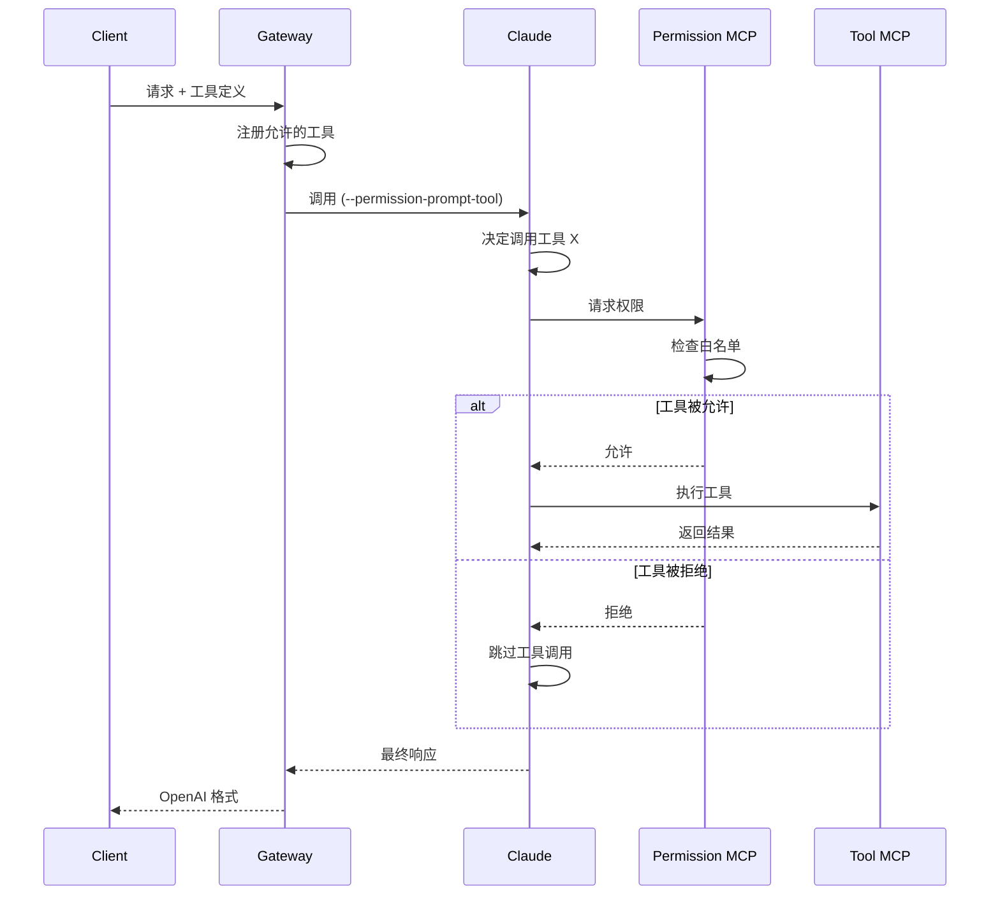

# 安全与权限控制

## 概述

本文档详细说明 Claude Code Gateway 的安全架构和权限控制机制。核心原则是**零信任安全**：默认拒绝所有操作，仅允许明确授权的行为。

## 核心安全挑战

1. **Claude Code 内置工具** - Bash、Edit、Write 等危险工具
2. **用户配置的 MCP 服务器** - ~/.claude/mcp.json 中的配置
3. **项目级 MCP 配置** - 项目目录中的 .mcp.json
4. **工具调用追踪** - 客户端需要感知所有工具调用

## 权限控制方案

### 方案一：基于 --permission-prompt-tool（推荐）⭐

使用 Claude Code 的权限提示工具参数，实现动态权限控制：

```typescript
// 1. 实现权限控制 MCP 服务器
class PermissionControlMCP {
  private allowedTools: Map<string, Set<string>> = new Map();
  
  // 注册会话的允许工具
  registerSession(sessionId: string, tools: OpenAITool[]) {
    const toolNames = new Set(
      tools.map(tool => `mcp__gateway__${tool.function.name}`)
    );
    this.allowedTools.set(sessionId, toolNames);
  }
  
  // 处理权限请求
  async handlePermissionRequest(
    toolName: string,
    sessionId: string
  ): Promise<{ allowed: boolean; reason: string }> {
    const sessionTools = this.allowedTools.get(sessionId);
    
    if (!sessionTools) {
      return { 
        allowed: false, 
        reason: 'Session not found' 
      };
    }
    
    const isAllowed = sessionTools.has(toolName);
    
    // 审计日志
    await this.audit({
      action: 'permission_check',
      sessionId,
      toolName,
      allowed: isAllowed,
      timestamp: new Date()
    });
    
    return {
      allowed: isAllowed,
      reason: isAllowed 
        ? 'Tool is in allowlist' 
        : 'Tool not permitted for this session'
    };
  }
}

// 2. 调用 Claude Code
const child = spawn('claude', [
  'query',
  prompt,
  '--permission-prompt-tool', 'permission',
  '--mcp-config', configPath
]);
```

#### 工作流程



### 方案二：显式工具列表

使用 SDK 的 allowedTools 和 disallowedTools 参数：

```typescript
// Claude Code 内置工具列表
const CLAUDE_BUILTIN_TOOLS = [
  'Bash',           // 执行命令
  'Edit',           // 编辑文件
  'Write',          // 写入文件
  'Read',           // 读取文件
  'Search',         // 搜索
  'Grep',           // 文本搜索
  'Glob',           // 文件匹配
  'TodoRead',       // 读取待办
  'TodoWrite',      // 写入待办
  'NotebookRead',   // 读取笔记本
  'NotebookEdit',   // 编辑笔记本
  'WebFetch',       // 网页获取
  'WebSearch'       // 网页搜索
];

// 调用时配置
const result = await query({
  prompt: buildPrompt(messages, sessionId),
  options: {
    // 只允许客户端定义的工具
    allowedTools: tools.map(t => `mcp__gateway__${t.function.name}`),
    // 禁用所有内置工具
    disallowedTools: CLAUDE_BUILTIN_TOOLS,
    // 跳过权限提示
    dangerouslySkipPermissions: true
  }
});
```

### 方案三：环境隔离

创建隔离的运行环境，避免读取默认配置：

```typescript
class IsolatedClaudeRunner {
  async runInIsolation(prompt: string, sessionId: string) {
    // 1. 创建临时目录
    const tempDir = mkdtempSync(join(tmpdir(), 'claude-'));
    
    // 2. 创建受控的 MCP 配置
    const mcpConfig = {
      mcpServers: {
        permission: {
          transport: "http",
          url: "http://localhost:3000/mcp/permission"
        },
        gateway: {
          transport: "http",
          url: "http://localhost:3000/mcp/gateway"
        }
      }
    };
    
    writeFileSync(join(tempDir, 'mcp.json'), JSON.stringify(mcpConfig));
    
    // 3. 使用隔离环境运行
    const env = {
      ...process.env,
      CLAUDE_CONFIG_DIR: tempDir,
      CLAUDE_DISABLE_DEFAULT_CONFIG: 'true'
    };
    
    const child = spawn('claude', ['query', prompt], { env });
    
    // 4. 清理
    await cleanup(tempDir);
  }
}
```

## 审计和监控

### 审计日志系统

```typescript
interface AuditLog {
  timestamp: Date;
  sessionId: string;
  action: 'permission_check' | 'tool_call' | 'error';
  details: {
    toolName?: string;
    allowed?: boolean;
    reason?: string;
    error?: string;
  };
}

class AuditService {
  private logs: AuditLog[] = [];
  
  async log(entry: AuditLog) {
    // 1. 内存存储
    this.logs.push(entry);
    
    // 2. 持久化存储
    await this.persist(entry);
    
    // 3. 实时告警
    if (entry.action === 'error' || !entry.details.allowed) {
      await this.alert(entry);
    }
  }
  
  // 生成审计报告
  generateReport(sessionId?: string): AuditReport {
    const logs = sessionId 
      ? this.logs.filter(l => l.sessionId === sessionId)
      : this.logs;
    
    return {
      totalRequests: logs.length,
      allowedCalls: logs.filter(l => l.details.allowed).length,
      deniedCalls: logs.filter(l => !l.details.allowed).length,
      errors: logs.filter(l => l.action === 'error').length,
      topTools: this.getTopTools(logs),
      timeline: this.generateTimeline(logs)
    };
  }
}
```

### 实时监控

```typescript
class SecurityMonitor {
  // 检测异常模式
  detectAnomalies(sessionId: string): Alert[] {
    const alerts: Alert[] = [];
    
    // 1. 频率异常
    if (this.getCallRate(sessionId) > RATE_LIMIT) {
      alerts.push({
        type: 'rate_limit',
        message: 'Too many tool calls',
        severity: 'high'
      });
    }
    
    // 2. 未授权尝试
    const deniedAttempts = this.getDeniedAttempts(sessionId);
    if (deniedAttempts > 0) {
      alerts.push({
        type: 'unauthorized',
        message: `${deniedAttempts} unauthorized tool attempts`,
        severity: 'medium'
      });
    }
    
    // 3. 敏感工具调用
    const sensitiveTools = this.getSensitiveToolCalls(sessionId);
    if (sensitiveTools.length > 0) {
      alerts.push({
        type: 'sensitive_tools',
        message: `Attempted to use: ${sensitiveTools.join(', ')}`,
        severity: 'high'
      });
    }
    
    return alerts;
  }
}
```

## 最佳实践

### 1. 默认拒绝原则

```typescript
// 不好的做法 ❌
if (toolName.includes('dangerous')) {
  return false;
}
return true; // 默认允许

// 好的做法 ✅
if (!allowedTools.has(toolName)) {
  return false; // 默认拒绝
}
return true;
```

### 2. 会话隔离

```typescript
class SessionManager {
  private sessions = new Map<string, SessionContext>();
  
  createSession(id: string, tools: OpenAITool[]): SessionContext {
    const context = {
      id,
      allowedTools: new Set(tools.map(t => t.function.name)),
      createdAt: new Date(),
      expiresAt: new Date(Date.now() + SESSION_TIMEOUT)
    };
    
    this.sessions.set(id, context);
    
    // 自动清理过期会话
    setTimeout(() => {
      this.sessions.delete(id);
    }, SESSION_TIMEOUT);
    
    return context;
  }
}
```

### 3. 工具名称验证

```typescript
function validateToolName(name: string): boolean {
  // 检查格式
  const pattern = /^mcp__[a-zA-Z0-9_]+__[a-zA-Z0-9_]+$/;
  if (!pattern.test(name)) {
    return false;
  }
  
  // 检查黑名单
  const blacklist = ['eval', 'exec', 'system'];
  const parts = name.split('__');
  if (blacklist.some(b => parts.includes(b))) {
    return false;
  }
  
  return true;
}
```

### 4. 错误处理

```typescript
class SecureErrorHandler {
  handle(error: Error, context: RequestContext): ErrorResponse {
    // 1. 记录详细错误（内部）
    logger.error({
      error: error.stack,
      context,
      timestamp: new Date()
    });
    
    // 2. 返回安全的错误信息（外部）
    return {
      error: {
        message: this.sanitizeMessage(error.message),
        type: 'api_error',
        code: this.getErrorCode(error)
      }
    };
  }
  
  // 清理敏感信息
  sanitizeMessage(message: string): string {
    // 移除路径信息
    message = message.replace(/\/[\w\/]+/g, '[PATH]');
    // 移除 IP 地址
    message = message.replace(/\d{1,3}\.\d{1,3}\.\d{1,3}\.\d{1,3}/g, '[IP]');
    return message;
  }
}
```

## 安全检查清单

### 部署前检查

- [ ] 所有内置工具都在禁用列表中
- [ ] 权限控制服务正常运行
- [ ] 审计日志系统已启用
- [ ] 会话超时机制已配置
- [ ] 错误信息已脱敏
- [ ] 速率限制已启用

### 运行时监控

- [ ] 监控未授权的工具调用尝试
- [ ] 监控异常的调用频率
- [ ] 监控会话生命周期
- [ ] 监控错误率
- [ ] 定期审查审计日志

### 定期审查

- [ ] 更新 Claude Code 内置工具列表
- [ ] 审查权限策略有效性
- [ ] 检查是否有新的安全威胁
- [ ] 更新安全文档

## 紧急响应

### 安全事件处理流程

1. **检测** - 通过监控系统发现异常
2. **隔离** - 暂停相关会话或服务
3. **分析** - 查看审计日志，定位问题
4. **修复** - 更新权限策略或代码
5. **恢复** - 逐步恢复服务
6. **复盘** - 更新安全策略和文档

### 联系方式

- 安全团队：security@example.com
- 紧急热线：+86-xxx-xxxx-xxxx
- 值班人员：通过 PagerDuty 呼叫

## 总结

通过多层次的安全控制，我们确保：

1. **最小权限** - 只允许必要的工具调用
2. **完全可控** - 所有操作都经过授权
3. **可审计** - 完整的操作日志
4. **快速响应** - 实时监控和告警

记住：安全不是一次性的工作，而是持续的过程。