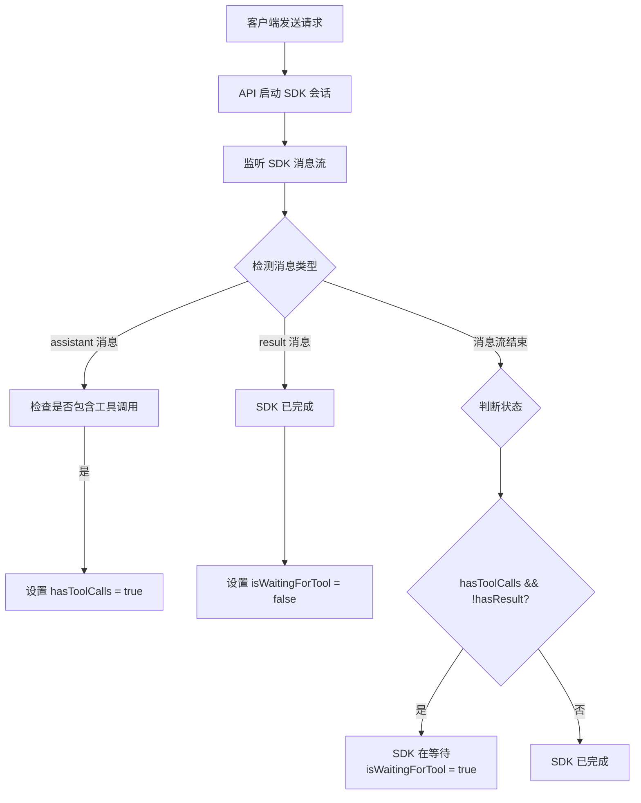

# API 服务如何判断 Claude Code SDK 在等待工具调用

## 判断机制概述

API 服务通过监控 SDK 的消息流来判断其是否在等待工具调用结果。核心原理是：**SDK 在等待时不会发送 `result` 消息**。

## 判断流程



## 代码实现

### 1. ClaudeSessionManager 中的判断

```typescript
// src/services/claude-session-manager.ts
async *startSession(sessionId: string, ...) {
    let hasToolCalls = false;
    
    for await (const message of messageStream) {
        // 1. 收集所有消息
        session.pendingMessages.push(message);
        
        // 2. 检测工具调用
        if (message.type === 'assistant' && message.message?.content) {
            const content = message.message.content;
            if (Array.isArray(content)) {
                for (const block of content) {
                    if (block.type === 'tool_use') {
                        hasToolCalls = true;
                    }
                }
            }
        }
        
        // 3. 检测 result 消息
        if (message.type === 'result') {
            session.isWaitingForTool = false;
        }
        
        yield message;
    }
    
    // 4. 最终判断
    if (hasToolCalls && !session.pendingMessages.some(m => m.type === 'result')) {
        session.isWaitingForTool = true;
        console.log(`会话 ${sessionId} 正在等待工具调用结果`);
    }
}
```

### 2. ResponseProcessor 中的辅助判断

```typescript
// src/utils/response-helper.ts
static async processMessageStream(messageStream, onToolCall) {
    const messages = [];
    let hasToolCalls = false;
    
    for await (const message of messageStream) {
        messages.push(message);
        
        // 收集工具调用
        if (/* 检测到工具调用 */) {
            hasToolCalls = true;
        }
        
        // 检测完成
        if (message.type === 'result') {
            console.log('SDK 完成当前轮次');
            break;
        }
    }
    
    // 判断状态
    const hasResultMessage = messages.some(m => m.type === 'result');
    if (hasToolCalls && !hasResultMessage) {
        console.log('SDK 正在等待工具调用结果（未收到 result 消息）');
    }
}
```

## 关键点

### 1. SDK 的行为模式

- **发起工具调用后**：SDK 暂停，不发送 `result` 消息
- **等待工具结果时**：保持会话开放，等待客户端响应
- **收到结果后**：继续处理，最终发送 `result` 消息
- **stop_reason 标识**：包含工具调用的 assistant 消息会有 `stop_reason: "tool_use"`

### 2. 判断时机

API 服务在以下时机进行判断：

1. **消息流结束时**：当 SDK 的消息流结束但没有 `result` 消息
2. **实时监控**：在处理每个消息时更新状态
3. **会话恢复时**：检查缓存的会话状态
4. **检测 stop_reason**：当 assistant 消息包含 `stop_reason: "tool_use"` 时

### 3. 状态标记

```typescript
interface RunningSession {
    sessionId: string;
    isWaitingForTool: boolean;  // 关键标记
    pendingMessages: SDKMessage[];
    // ...
}
```

## 实际应用

### 1. 非流式响应

```typescript
async processNonStream(options) {
    const messages = await ResponseHelper.processMessageStream(messageStream);
    
    // API 返回工具调用给客户端
    if (hasToolCalls && !hasResult) {
        return {
            choices: [{
                message: {
                    tool_calls: [...],  // 返回工具调用
                    content: null
                },
                finish_reason: 'tool_calls'
            }]
        };
    }
}
```

### 2. 流式响应

```typescript
async processStream(res, options) {
    for await (const message of messageStream) {
        if (/* 检测到工具调用 */) {
            writer.sendToolCall(toolCall);
            writer.endStream('tool_calls');
            return;  // 结束流，等待客户端
        }
    }
}
```

### 3. 会话恢复

当客户端返回工具结果时：

```typescript
// 客户端发送包含工具结果的消息
POST /v1/chat/completions
{
    messages: [
        { role: "user", content: "..." },
        { role: "assistant", tool_calls: [...] },
        { role: "tool", content: "结果" }  // 工具结果
    ]
}

// API 服务：
1. 通过消息匹配找到等待中的会话
2. 检查 isWaitingForTool = true
3. 继续该会话而不是创建新会话
```

## 总结

API 服务通过以下机制判断 SDK 等待状态：

1. **核心指标**：`有工具调用 + 无 result 消息 = 等待中`
2. **辅助指标**：`stop_reason: "tool_use"` 明确表示因工具调用而停止
3. **状态存储**：`session.isWaitingForTool` 标记
4. **实时监控**：在消息流处理过程中动态更新
5. **会话管理**：保持等待中的会话，支持后续恢复

### SDK 消息示例

当 SDK 需要调用工具时：
```json
{
  "type": "assistant",
  "message": {
    "content": [{
      "type": "tool_use",
      "name": "mcp__gateway__read_file",
      "id": "tool_123",
      "input": {"path": "test.txt"}
    }],
    "stop_reason": "tool_use"  // 关键标识
  }
}
// 之后没有 result 消息，SDK 在等待工具结果
```

当工具不可用时，SDK 会自动发送用户消息：
```json
{
  "type": "user",
  "message": {
    "content": [{
      "type": "tool_result",
      "tool_use_id": "tool_123",
      "content": "I'll try to help you with reading test.txt..."  // SDK 自动生成的响应
    }]
  }
}
```

这种设计确保了 API 服务能够准确跟踪 SDK 状态，正确处理工具调用流程。